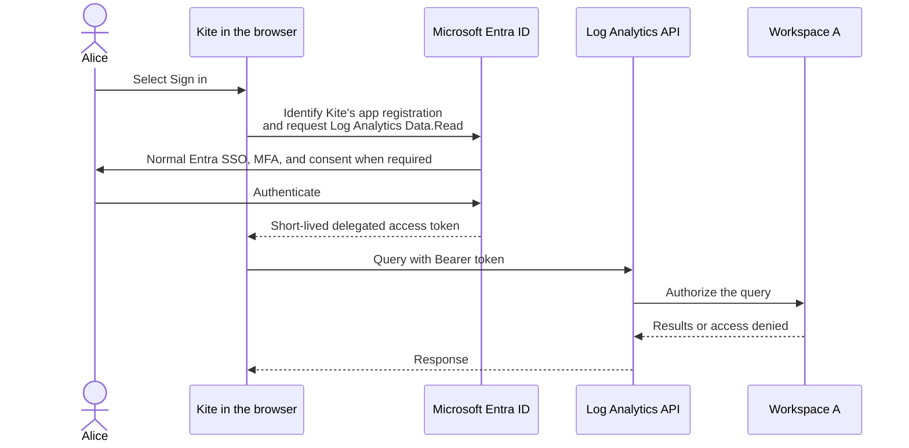

# Understanding Entra authentication for Log Analytics

Kite can query an Azure Log Analytics workspace directly from the browser. This guide explains the identities involved and why a user sign-in still needs a Microsoft Entra app registration.

## The four things to distinguish

| Thing | What it is | What it controls |
| --- | --- | --- |
| **User** | A person, such as Alice | Who is signing in and which Azure resources they may access |
| **App registration** | Kite's identity/configuration in Microsoft Entra ID | Which browser URLs may receive a sign-in response and which API permissions Kite may request |
| **Enterprise application (service principal)** | The tenant-local instance of Kite's app registration | Tenant policy and Azure role assignments that target Kite as an application |
| **Log Analytics workspace** | The Azure resource containing log data | Which identities may query its data |

An app registration is Kite's identity card in Entra. It is not a user account, does not hold user passwords, and does not give a user access to workspace data by itself.

## What happens when a user signs in



This is a **user-delegated** sign-in. Alice signs in as herself, but she does so through Kite's registered application. The resulting token represents both facts:

```text
User: Alice
Client application: Kite
Requested API permission: Log Analytics Data.Read
```

Kite uses the recommended browser authorization-code flow with PKCE. It has a public client ID but no client secret, and no Kite backend is involved in this flow.

## Delegated and application permissions

Microsoft Entra API permissions describe who an access token represents.

| Permission type | Token represents | Typical use |
| --- | --- | --- |
| **Delegated** | A signed-in user using an app | Browser and other interactive applications |
| **Application** | The app's service principal itself | Backends, scheduled jobs, and other unattended services |

Kite's browser-only integration uses the delegated **Log Analytics API / Data.Read** permission. The token means: **Alice is using Kite**. Alice authenticates interactively, and her workspace access remains relevant to the authorization decision.

Application permissions are different. No person signs in; a backend authenticates as the Kite service principal using a secret, certificate, managed identity, or workload federation. The token means: **Kite itself is acting**. This model is appropriate for a future server-side integration, but not for browser-only Kite because a browser cannot safely keep a service-principal credential.

The service principal is still useful in the browser design: it is Kite's tenant-local application identity and can be targeted by tenant policy or Azure role assignments. It is not the identity that interactively signs in to Kite.

## Two independent access checks

Successful sign-in does not guarantee that a query succeeds. Azure evaluates separate concerns:

```text
Can Kite request this kind of token?
  App registration + consent for Log Analytics API / Data.Read

Can the requested workspace be queried?
  Azure RBAC and the workspace's access-control configuration
```

For a browser-based deployment, configure the following deliberately:

1. The **app registration** requests the delegated `Log Analytics API / Data.Read` permission.
2. The **enterprise application** can receive any workspace role assignment required by the selected Log Analytics authorization model.
3. The **user or their Entra group** receives access to the intended workspace data when the workspace's model evaluates user/group permissions.

Microsoft's Log Analytics API setup guide shows assigning the application a Reader role on the workspace. Workspace and table-level RBAC can also limit data by user or group. Follow your organisation's Azure RBAC model and use the narrowest roles that support the intended queries.

## Example: Alice can query A but not B

Assume Kite is registered correctly and Entra has granted the required API consent.

| Identity or application     | Workspace A          | Workspace B  |
| --------------------------- | -------------------- | ------------ |
| Kite enterprise application | Allowed to query     | Not assigned |
| Alice or Alice's group      | Allowed to read data | Not assigned |

Alice can sign in to Kite in both cases. A query to Workspace A succeeds; a query to Workspace B is denied because it lacks the relevant workspace assignment.

The app registration did not give Alice access to Workspace A. It only allowed Kite to ask Entra for the appropriate type of token. Azure RBAC made the data-access decision.

## Why Kite needs an app registration

Microsoft Entra cannot safely issue a browser token to an anonymous web page. The registration tells Entra:

- which app is asking for a token, through its client ID;
- which exact Kite URLs may receive the sign-in response;
- that Kite is a single-page application using a secure browser flow; and
- which API permission Kite may request.

For self-hosted Kite, register every exact browser origin as an SPA redirect URI. Kite uses a dedicated popup callback, so register both the root URI and `/auth/callback`, such as `https://kite.humblehamster.com/` and `https://kite.humblehamster.com/auth/callback`; do the same for `http://localhost:5173`. Do not configure a client secret for the browser application: anyone using Kite could extract it. See [the connection setup guide](log-analytics-authentication.md) for the full procedure.

## Further reading

- [Azure Monitor Logs API access and authentication](https://learn.microsoft.com/en-us/azure/azure-monitor/logs/api/access-api)
- [Manage access to Log Analytics workspaces](https://learn.microsoft.com/en-us/azure/azure-monitor/logs/manage-access)
- [Microsoft Entra authorization-code flow](https://learn.microsoft.com/en-us/entra/identity-platform/v2-oauth2-auth-code-flow)
