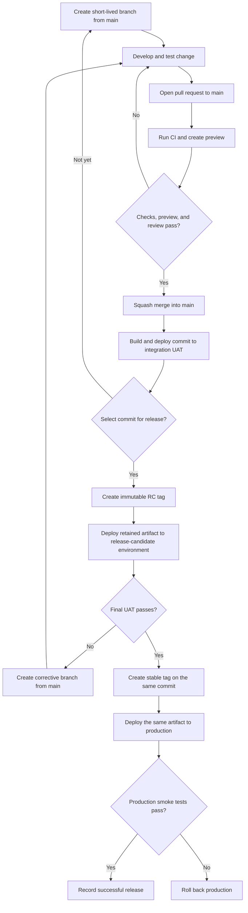
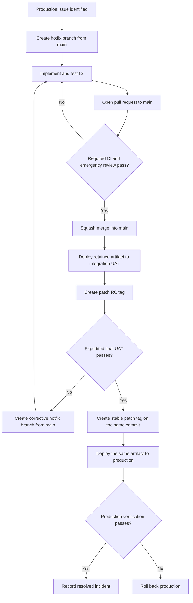

# CI/CD Strategy

## Technology stack

- TypeScript and JavaScript
- SvelteKit
- Node.js
- Vite
- Cloudflare Pages

## Purpose

This document defines the intended continuous integration and deployment process for Kite. It describes policies, validation stages, release flows, implemented GitHub Actions, and repository controls managed as infrastructure as code.

Kite uses a trunk-based workflow centered on a protected `main` branch. Environments are selected by the source revision or release tag:

| Source | Environment | Purpose |
| --- | --- | --- |
| Pull-request revision | Preview | Isolated validation of a proposed change |
| Commit on `main` | Integration UAT | Validation of the latest integrated changes |
| Prerelease tag such as `v1.2.0-rc.1` | Release candidate | Frozen candidate for final UAT and approval |
| Stable tag such as `v1.2.0` | Production | Approved production release |

The environment invariants are:

- `main` is the latest integrated and releasable code.
- An RC tag is the exact revision currently undergoing final UAT.
- A stable version tag is the exact revision approved for production.
- Production is the latest successfully deployed stable version tag.

`main` may move ahead while a release candidate is being evaluated. Production therefore does not necessarily run the current head of `main`.

## Branch policy

The repository follows these rules:

- Feature, fix, maintenance, and hotfix branches start from the latest `main`.
- Working branches are short-lived and contain one cohesive change.
- Changes to `main` are made through pull requests. Direct pushes and force pushes are prohibited.
- Pull requests must pass the required CI checks, receive the required approval, and resolve review conversations before they are merged.
- Approved pull requests are squash merged into `main`.
- Merging into `main` triggers deployment of the resulting commit to integration UAT.
- Incomplete functionality is kept out of `main` or safely disabled with a feature flag.

### Merge strategy

Short-lived branches are squash merged into `main`. This keeps the shared history concise and gives each reviewed change a single, reversible commit. Contributors may use as many local commits as they need while developing a change.

Pull requests should be rebased or updated when required so that CI validates the change against the latest `main`. After merging, the resulting squash commit becomes eligible for UAT and release candidate selection.

## Continuous integration

CI validates a proposed change without deploying it to UAT or production. Pull requests targeting `main` must cover the following categories:

1. Formatting and static analysis
2. Type checking
3. Unit tests
4. Production build verification
5. End-to-end or smoke tests
6. Dependency and security checks

The exact checks and commands will be defined with the workflow implementation. Required checks must pass before a pull request can be merged.

The Pull Request workflow prepares and caches `static/kusto-docs` before starting its Cloudflare and container validation jobs. Both build targets restore the same cache and then run in parallel, avoiding duplicate documentation downloads while preserving clean-checkout behavior when the cache is empty. The key combines the UTC ISO week and generator hash, so Main UAT and release container builds reuse documentation within a week while refreshing it weekly or whenever the generator changes.

### KQL translator WebAssembly artifact

The browser-emulated cluster depends on the .NET WebAssembly bridge from the source-pinned [`Jiayang-Lai/kql-to-sql`](https://github.com/Jiayang-Lai/kql-to-sql) Git submodule. Kite publishes the resulting framework at `static/kql-wasm/_framework`; generated files remain ignored by Git.

PR and Main UAT workflows initialize the submodule recursively, install the workload declared by its `global.json`, and build the bridge before validating Kite. The local equivalent is:

```bash
git submodule update --init --recursive
dotnet workload restore vendor/kql-to-sql/src/KqlWasmBridge/KqlWasmBridge.csproj
npm run build:kql-wasm
```

The build creates `static/kql-wasm/manifest.json` with the translator commit. `npm run build` verifies the manifest and required framework files before creating the Cloudflare bundle, and the workflow verifies that the final bundle contains `kql-wasm/_framework/dotnet.js`. Release candidate and production deployments promote that retained bundle without rebuilding it, so they cannot combine an unreviewed translator revision with a frozen Kite release.

## Preview environments

Where practical, each pull request receives an isolated preview deployment of its current revision. The preview environment supports review, exploratory testing, and acceptance testing without combining unrelated changes.

Preview deployments:

- are created only after the required preview build succeeds;
- use non-production configuration and credentials;
- never receive UAT or production secrets;
- are updated when the pull request changes;
- are identified by their pull request and commit; and
- are removed or allowed to expire after the pull request closes.

A preview deployment complements CI but does not replace automated validation.

## Standard development and release flow



The lifecycle is:

1. Update local `main` and create a short-lived branch.
2. Develop and test one cohesive change.
3. Open a pull request targeting `main`.
4. Run CI and create a preview deployment.
5. Review the code and validate the preview.
6. Squash merge the pull request after all required checks and approvals pass.
7. Build the resulting `main` commit, retain its artifact, and deploy it to integration UAT.
8. Select a successfully validated commit as a release candidate.
9. Create an immutable prerelease tag and deploy its retained artifact to the release-candidate environment.
10. Complete final UAT against that frozen candidate.
11. Create a stable version tag on the exact same commit after approval.
12. Deploy the same retained artifact to production.
13. Run production smoke tests and record the deployment result.

## Artifact promotion

The artifact is built from a specific commit on `main` and identified by that commit SHA. The same artifact must be used for integration UAT, the release candidate, and production. Promotion changes the target environment, not the artifact contents.

The committed lockfile must be used when building the artifact. The artifact and its checksum must be retained long enough to complete UAT, production deployment, and any required audit.

If the deployment platform cannot promote an existing deployment directly, the delivery workflow must upload the same retained artifact to the next environment instead of rebuilding it. A rebuild is permitted only as a documented fallback and must be reproducible and verified against the original artifact.

## Release candidates

Release candidates use immutable semantic-version prerelease tags:

```text
v1.2.0-rc.1
v1.2.0-rc.2
```

Creating an RC tag freezes the candidate identity. The tag must:

- point to a commit contained in `main`;
- identify a commit that passed the required CI checks;
- identify an artifact successfully deployed to integration UAT; and
- be created only by an authorized maintainer or release workflow.

The release-candidate environment changes only when a new RC tag is created. New commits on `main` continue to deploy to integration UAT but do not replace the frozen release candidate.

If UAT discovers a defect:

1. Fix the defect through the normal pull-request workflow.
2. Squash merge the fix into `main`.
3. Build and validate the new `main` commit in integration UAT.
4. Create the next RC tag on that commit.
5. Repeat final UAT.

An existing RC tag is never moved, reused, or deleted to hide a failed candidate. Each attempt gets a new prerelease number.

## Production release

After final UAT approval, create the corresponding stable semantic-version tag:

```text
v1.2.0
```

The stable tag and the approved final RC tag must resolve to the same commit:

```text
v1.2.0-rc.2 ──┐
               ├── commit abc123
v1.2.0 ────────┘
```

The production workflow accepts stable semantic-version tags only. Tags with a prerelease suffix, including `-rc.N`, must never trigger production deployment.

Stable tags and their release records are immutable. Tag creation, updates, and deletion are restricted to authorized maintainers or release automation. Publishing the stable tag represents release approval; an additional protected-environment approval may be required when separation of duties is needed.

## Release readiness

A commit is ready to become a release candidate when:

- all required CI checks pass;
- its integration UAT deployment succeeds;
- the intended release contents are known;
- incomplete functionality is safely disabled behind a feature flag; and
- an authorized maintainer selects the commit.

A release candidate is ready for a stable production tag when:

- final UAT succeeds against the frozen RC deployment;
- the stable tag will point to the same commit as the approved RC tag;
- the retained artifact and checksum match the UAT-tested artifact;
- known risks or regressions are documented; and
- an authorized maintainer approves the production release.

A release is successful only after the production deployment and its smoke tests pass.

## Incomplete and dependent work

Changes should be small and independently releasable. Larger features should be divided into safe increments and hidden behind a feature flag until complete.

Use the following approaches when work cannot ship immediately:

- keep the pull request in draft;
- use a feature flag with a safe default;
- keep unused routes or capabilities disabled;
- use stacked short-lived branches when changes must be reviewed in sequence; or
- use a temporary shared feature branch when several changes must be tested together.

Temporary branches do not become permanent deployment branches and are deleted after the work is integrated.

An RC normally includes everything merged into `main` before the selected commit. Use short validation windows and feature flags to prevent unrelated work from delaying a release. If long stabilization periods become necessary, the team may introduce a temporary release branch through a separate policy decision.

## Hotfix flow

A hotfix is an urgent production fix. It follows the normal branch, UAT, and tag-promotion process with expedited review while retaining the required safety checks.



Because `main` is the only long-lived branch, a released hotfix does not require synchronization with another branch.

## Deployment policy

- CI and deployment are separate stages. Deployment begins only after the relevant CI and review gates succeed.
- Preview environments deploy pull-request revisions.
- Integration UAT deploys commits from `main`.
- The release-candidate environment deploys only immutable RC tags.
- Production deploys only immutable stable version tags.
- Each environment has at most one active deployment. Obsolete preview and integration UAT deployments may be cancelled, while RC and production deployments run serially.
- Preview, UAT, RC, and production configuration and secrets are isolated from each other.
- Production credentials are unavailable to pull-request, integration UAT, and RC jobs.
- The deployment system records the source commit, tag, pull request, environment, initiator, run identifier, artifact checksum, and result.
- Only authorized maintainers can create release tags or initiate a production deployment or rollback.
- A single deployment owner must be used for each environment to avoid duplicate deployments.

## Failure and rollback policy

If a production deployment or its smoke tests fail:

1. Stop any newer production promotion until the failure is understood.
2. Mark the deployment and release as failed.
3. Restore the last known healthy production deployment when user impact is possible.
4. Do not move or reuse the failed release tag.
5. Revert the responsible squash commit or prepare a tested corrective change on `main`.
6. Issue a new RC and stable patch version through the normal validation process.
7. Record the cause, affected revision, rollback, and follow-up action.

Emergency rollback may be initiated by an authorized maintainer without waiting for normal release approval, but the rollback and its reason must remain traceable.

## Release traceability

Every deployment should record:

- the source commit SHA;
- the associated pull request;
- the RC or stable tag, when applicable;
- the target environment;
- the workflow or deployment run identifier;
- the artifact identifier and checksum;
- the UAT approval associated with the final RC;
- the deployment and smoke-test results; and
- the production version.

## Implemented workflows

| Workflow | Trigger | Result |
| --- | --- | --- |
| `pull-request.yml` | Pull request targeting `main` | Runs unprivileged validation and uploads the prospective merge artifact |
| `preview.yml` | Successful Pull Request workflow | Verifies the current internal PR and deploys its artifact using trusted `main` tooling |
| `main-uat.yml` | Push to `main` | Runs validation, retains the commit artifact, deploys integration UAT, and runs a smoke test |
| `release.yml` | Tag matching `v*` | Validates the tag, retains the approved RC artifact, and promotes it to RC or production |

The pull-request workflow never receives Cloudflare credentials. A separate `workflow_run` workflow defined on trusted `main` verifies that the successful run belongs to the current revision of an open, same-repository pull request targeting `main`. It then downloads that run's validated artifact and deploys it with dependencies installed from the trusted `main` lockfile. Pull requests from forks therefore run validation but cannot start a credential-bearing deployment job. Because `workflow_run` itself is associated with `main`, the preview job disables GitHub's automatic environment deployment record and explicitly creates a transient deployment for the originating PR head SHA. The resulting preview URL and deployment status therefore appear on the pull request.

The release workflow rejects malformed tags even though its broad trigger observes all tags beginning with `v`. It also verifies that:

- the tagged commit is contained in `main`;
- a retained artifact exists from a successful `Main UAT` workflow for that exact commit;
- a stable tag shares its commit with a valid RC tag; and
- the RC tag has a successful `release-candidate` GitHub deployment and retained RC artifact before production promotion.

## CI commands and deployment action

| Command | Purpose |
| --- | --- |
| `npm run test:unit:run` | Run unit tests once |
| `npm run lint:ci` | Check formatting for files currently enforced by CI |
| `npm run test:e2e:install` | Install Chromium and its operating-system dependencies |
| `npm run test:e2e` | Build the app and run Playwright tests |
| `npm run test:e2e:run` | Run Playwright tests against an existing production build |
| `npm run test:smoke -- --url <url>` | Verify a deployed environment with retries |
| `npm run test:ci` | Run formatting, type, unit, build, and end-to-end validation |
| `npm run security:audit` | Fail on high or critical production dependency advisories |
| `npm run release:validate-tag -- --tag <tag>` | Validate stable and RC semantic-version tags |
| `chrnorm/deployment-action@v2` | Create the preview's transient GitHub Deployment |
| `chrnorm/deployment-status@v2` | Record the preview deployment URL and final status |
| `cloudflare/wrangler-action@v3` | Upload the verified artifact to Cloudflare Pages in Actions |

The build workflows upload the Cloudflare adapter output together with its required `.svelte-kit/cloudflare-tmp` and `.svelte-kit/output/server` siblings and the generated `.svelte-kit/tsconfig.json` using GitHub's official artifact action. This preserves the relative imports used by the generated `_worker.js` and gives Wrangler the generated SvelteKit compiler configuration without retaining the entire `.svelte-kit` tree. Each upload receives an immutable artifact ID and SHA-256 digest. Deployment jobs bind downloads to the exact producing workflow run; release promotion additionally selects artifacts by immutable ID. The official download action fails on a digest mismatch. Cloudflare's Wrangler action deploys only the downloaded `cloudflare` directory and supplies the exact deployment URL used by the smoke test and GitHub Environment.

The preview workflow uses published deployment actions rather than maintaining GitHub Deployment API scripts in the repository. Like the other third-party actions, they are pinned to immutable commit SHAs in the workflow.

A successful RC run retains its downloaded artifact under the immutable RC tag. The stable release selects that RC artifact by ID from the successful RC workflow rather than selecting another build by name. Rebuilding the same commit therefore cannot silently substitute a different artifact after UAT approval.

`npm run lint:ci` is temporarily scoped to the CI/CD-owned files because the existing repository-wide `npm run lint` has a formatting backlog. After that baseline is normalized, `test:ci` should use the repository-wide check.

## Required GitHub configuration

Terraform creates these GitHub Environments:

| Environment         | Deployment source      | Suggested Pages branch                           |
| ------------------- | ---------------------- | ------------------------------------------------ |
| `preview`           | Internal pull requests | Generated as `pr-<number>`                       |
| `integration-uat`   | Commits on `main`      | `uat`                                            |
| `release-candidate` | RC tags                | `release-candidate`                              |
| `production`        | Stable tags            | The Pages project's configured production branch |

Terraform under `infra/github` creates the environments, deployment source policies, Actions variables, repository merge settings, and branch and tag rulesets. Configure the following values:

| Name                            | Kind                 | Scope                   |
| ------------------------------- | -------------------- | ----------------------- |
| `CLOUDFLARE_ACCOUNT_ID`         | Repository variable  | All four environments   |
| `CLOUDFLARE_PAGES_PROJECT_NAME` | Repository variable  | All four environments   |
| `CLOUDFLARE_PAGES_BRANCH`       | Environment variable | UAT, RC, and production |
| `CLOUDFLARE_API_TOKEN`          | Environment secret   | All four environments   |

The current Terraform configuration uses one Pages project for all environments. The production environment's `CLOUDFLARE_PAGES_BRANCH` must exactly match the production branch configured in Cloudflare Pages. The UAT and RC branches use different names so Cloudflare treats them as preview deployments with stable aliases. If the environments later use separate Pages projects, move `CLOUDFLARE_PAGES_PROJECT_NAME` from a repository variable to environment variables.

The GitHub `preview` environment admits deployments from `main` because the privileged `workflow_run` job executes the workflow definition and deployment tooling from the default branch. The workflow itself verifies the originating pull request before accessing its artifact. It uses the environment for its branch policy and secrets without creating a `main` deployment, then records a separate transient GitHub Deployment against the verified pull-request head SHA.

The Cloudflare token should be limited to the account and Pages permissions required for deployment. Production should require authorized reviewers and should prevent self-approval when separation of duties is required. RC and production tags should be protected by a tag ruleset that restricts creation, updates, and deletion.

The Terraform ruleset requires both `Validate` and `Validate container image` from the `Pull Request` workflow for `main`, allows only squash merging, and prohibits direct pushes, force pushes, and deletion. The production environment requires an authorized reviewer. The solo-maintainer default permits the repository owner to self-approve; enable prevention of self-review when a second maintainer is available.

The GitHub Terraform root deliberately does not handle the Cloudflare token. The separate `infra/cloudflare` root adopts the existing Pages project, generates an account-owned token with only `Pages Write`, and synchronizes it to all four GitHub environment secrets. That generated credential necessarily remains in the encrypted Cloudflare Terraform state. See `infra/github/README.md` and `infra/cloudflare/README.md` for state, authentication, first-apply, rotation, and team-hardening instructions.

## Creating a release

After selecting a successful integration UAT commit, create and push the first RC tag:

```bash
git tag -a v1.2.0-rc.1 <commit-sha> -m "Kite v1.2.0-rc.1"
git push origin v1.2.0-rc.1
```

Create a new RC tag for every corrected candidate. After the final RC deployment passes UAT, create the stable tag on the same commit:

```bash
git tag -a v1.2.0 <same-commit-sha> -m "Kite v1.2.0"
git push origin v1.2.0
```

Do not create the stable tag until the RC workflow and final UAT have completed successfully.
