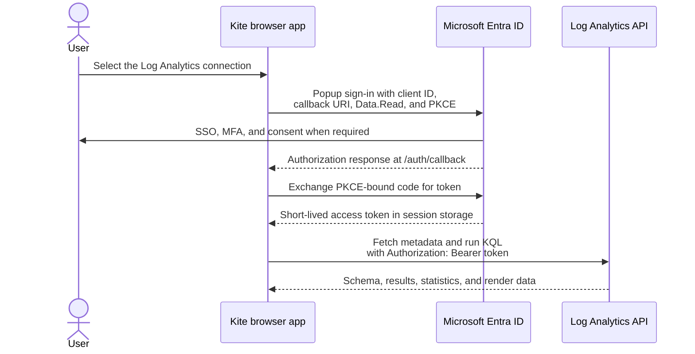
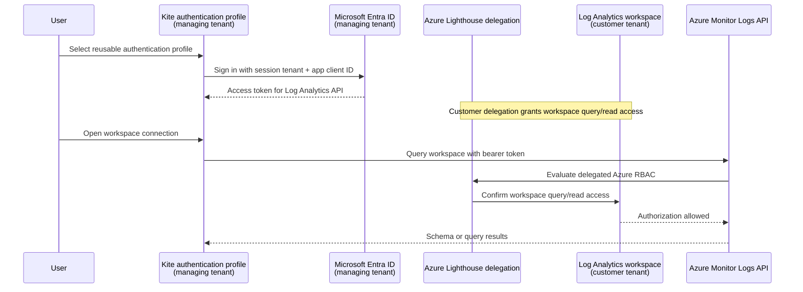

# Azure Log Analytics browser connection

Kite can query an Azure Log Analytics workspace directly from the browser. The connection is query-only: it supports KQL queries, workspace metadata, query statistics, and render details, but it does not support Kusto management commands, schema changes, or data ingestion.

See [Azure authentication terminology](azure-authentication-terminology.md) for the distinction between Kite authentication profiles, MSAL accounts, Entra browser sessions, and access tokens.

Kite uses Microsoft Entra authorization-code authentication with PKCE in a popup. It does not send access tokens through a Kite backend and does not accept or store a client secret.

For a conceptual explanation of users, app registrations, service principals, and delegated permissions, see [Understanding Entra authentication for Log Analytics](azure-entra-log-analytics-auth.md).

## Prerequisites

You need:

- a Log Analytics workspace;
- its **Workspace ID** (the immutable customer GUID);
- its **workspace resource ID** (the ARM path beginning `/subscriptions/...`);
- an Entra tenant ID or verified tenant domain;
- a public Entra SPA app registration and its application/client ID; and
- Log Analytics query access for the signed-in user or their Entra group.

If you use this repository's [Azure Terraform root](../infra/azure/README.md), retrieve the required values with:

```bash
terraform output tenant_id
terraform output application_client_id
terraform output log_analytics_workspace_id
terraform output log_analytics_workspace_resource_id
```

## Configure the Entra app registration

Create or configure a **Single-page application** registration in the target Entra tenant.

1. Under **Authentication**, add the Kite browser origin as an SPA redirect URI, including the root slash. For example, add both:

   ```text
   https://kite.humblehamster.com/
   https://kite.humblehamster.com/auth/callback
   ```

   For local development, add both:

   ```text
   http://localhost:5173/
   http://localhost:5173/auth/callback
   ```

   Register every deployed, preview, and local-development origin that users will actually open. The callback path is required because Kite uses it to complete the popup flow.

2. Under **API permissions**, add **Log Analytics API** → **Delegated permissions** → **Data.Read**.

3. Grant admin consent if your tenant policy requires it. This IaC root declares the requested permission but intentionally does not grant tenant-wide consent.

4. Do not create a client secret. Kite runs in the browser, where a secret could not remain confidential.

## Grant workspace access

Entra consent allows Kite to request a Logs API token; Azure RBAC controls which workspace data the signed-in user can query.

Assign the intended users or, preferably, an Entra security group the appropriate role at the workspace scope. `Log Analytics Reader` is the straightforward read-only starting role. For narrower access, use your organisation's custom or table-level access model.

New Azure RBAC assignments can take several minutes to propagate to the Logs Query API. A successful sign-in followed by a `403` query response usually means the user or group has not yet received suitable workspace access.

## Add the connection in Kite

Open the cluster selector, choose **Add cluster**, and select **Azure Log Analytics**. Enter:

| Kite field | Value |
| --- | --- |
| Name | A friendly connection name; it becomes the workspace database name in Kite's explorer |
| Workspace ID | The workspace/customer GUID |
| Workspace resource ID | The complete Azure Resource Manager workspace ID |
| Entra tenant ID or domain | The Entra tenant containing the app registration |
| Application (client) ID | The public SPA app registration's client ID |
| Default timespan | Optional ISO 8601 duration, such as `PT24H` or `P7D` |

Save the connection and select it. Kite opens an Entra sign-in popup when it first needs a token, then loads workspace tables and functions into the Explorer and KQL editor.

## Authentication and request flow



Kite silently renews a usable token when possible. If Entra requires interaction again, Kite opens a popup rather than redirecting the main Kite window.

Use **Settings → Azure authentication profiles** to sign in or out. **Sign out** opens Microsoft Entra's server sign-out page in a popup for the selected account while clearing Kite's local MSAL cache. Removing a profile can instead clear the Kite sign-in only, without ending upstream Entra browser SSO.

To let Entra target the selected account without showing its account picker, configure the optional `login_hint` claim in the app registration's ID tokens. Kite passes that claim as `logout_hint` when it is available.

## Azure Lighthouse cross-tenant access

An Azure authentication profile can belong to a user in a managing tenant while the queried Log Analytics workspace belongs to a customer tenant. Azure Lighthouse must delegate workspace query permissions to that user, such as the permissions provided by the `Log Analytics Reader` role.



The query request goes to `https://api.loganalytics.azure.com`; metadata requests use the resource-scoped Logs metadata endpoint. Kite stores the tenant, client, workspace, and optional timespan in browser connection storage. These are identifiers, not secrets. MSAL uses `sessionStorage` for its token cache, so closing the browser tab/session removes that cached sign-in state.

## Troubleshooting

| Symptom | Likely cause and action |
| --- | --- |
| Redirect URI mismatch | Register both the root URI and `/auth/callback` for the exact Kite origin, including its protocol and port. |
| Popup blocked | Retry using the connection selector or query action directly, and allow popups for the Kite site. |
| Admin approval required | Ask an Entra administrator to consent to **Log Analytics API / Data.Read**. |
| `403` after sign-in | Verify the signed-in user/group has Log Analytics workspace query access and allow time for RBAC propagation. |
| Connection asks for workspace resource ID | Edit the connection and enter the full ARM workspace ID; Kite needs it to load metadata. |
| Management or ingestion controls unavailable | Expected: Azure Log Analytics is intentionally query-only in Kite. |

## References

- [Azure Monitor Logs API access and authentication](https://learn.microsoft.com/en-us/azure/azure-monitor/logs/api/access-api)
- [Request format for the Azure Monitor Logs API](https://learn.microsoft.com/en-us/azure/azure-monitor/logs/api/request-format)
- [Manage access to Log Analytics workspaces](https://learn.microsoft.com/en-us/azure/azure-monitor/logs/manage-access)
