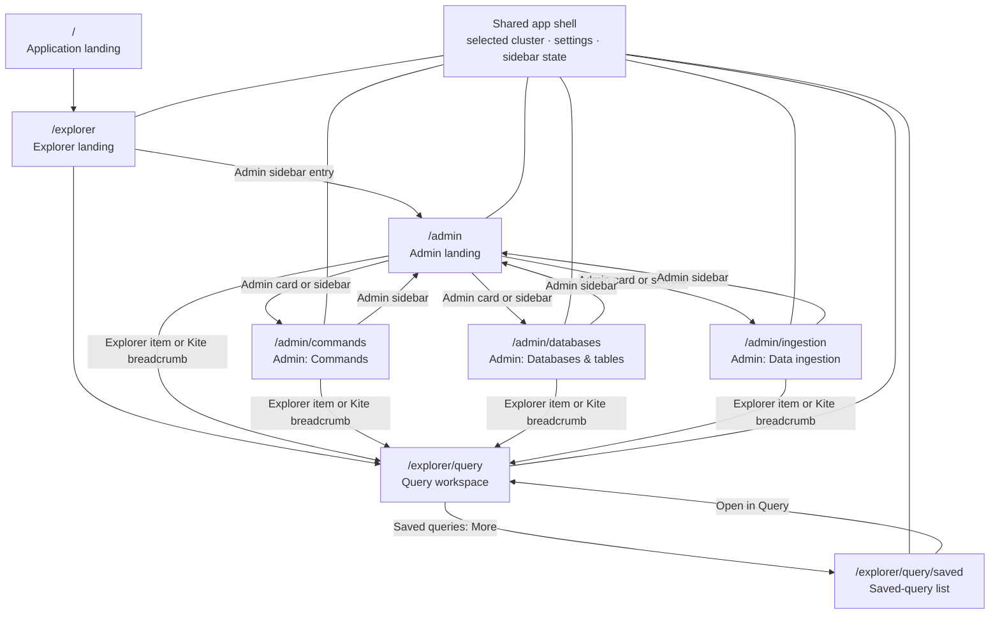

# Workspace UX flow

## Goal

Explorer and Admin are sibling workspaces that share the selected cluster, application shell, and
settings. The Explorer stays available in both workspaces, but selecting an Explorer item from an
Admin route opens that item in Explorer.

## Routes

```text
/                 → Application landing page
/explorer         → Explorer landing page
/explorer/query   → Query workspace
/explorer/query/saved → Saved-query list
/admin            → Admin landing page
/admin/commands   → Management commands
/admin/databases  → Database and table management
/admin/ingestion  → Data ingestion
```

## Transitions



## Sidebar hierarchy

```text
CONNECTION
  Local Kusto                     ⌄

EXPLORER
  Search databases and objects
  Databases
  Saved queries (first 5, then More → /explorer/query/saved)
  Recent queries

ADMIN
  Commands
  Databases & tables
  Data ingestion
```

The Explorer and flattened Admin group are present on Explorer and Admin routes. The Admin landing
page is `/admin`; the group provides direct access to the feature routes, including Commands at
`/admin/commands`. It is visually
distinct from the sidebar cluster selector, which sets global connection context. On Admin routes,
choosing a database, table, function, saved query, or recent query opens Explorer with that context;
saved and recent queries also restore their KQL in the editor.

Saved queries are stored in browser local storage and scoped to the selected connection's stable ID.
The Query toolbar provides a Save action that asks for a name, then persists the current editor text
and database context. The mock cluster also supplies fixed Saved and Recent query fixtures; remote
connections show only user-saved queries until query history is available.

Recent queries are also stored in browser local storage. Every submitted runnable query is added to
the history, duplicate executions move to the top, and the collection retains only its latest three
entries.

Breadcrumbs provide a second route back to Query:

```text
Kite / Explorer
Kite / Explorer / Query
Kite / Explorer / Query / Saved queries
Kite / Admin
Kite / Admin / Management commands
Kite / Admin / Databases & tables
Kite / Admin / Data ingestion
```

The `Kite` breadcrumb links to `/`. The selected cluster, loaded schema, Explorer selection,
and pending query remain available across route transitions. Opening an Admin route directly
also loads the active cluster schema so Explorer content is available.

## Database and table management

`/admin/databases` browses the active cluster schema and provides structured updates for existing
tables on remote connections. **New table** creates an empty table in the selected database with a
validated name, ordered initial columns, and optional description and folder. The dialog previews
the single `.create table` command and requires typing `CREATE TableName`. Immediately before
execution, Kite refreshes the database schema and blocks creation if that name is now occupied.

The table editor can update a table description and append columns.
The editor shows the generated management command and requires typing `RUN` before execution. The
Mock cluster remains schema-only.

Each existing column also has an admin action menu. Rename opens a focused dialog, previews the
`.rename column` command, warns that stored functions, ingestion mappings, policies, dashboards, and
client queries aren't rewritten, and requires typing `RENAME`. Remove previews the `.drop column`
command, identifies the column type and current table row count, and requires typing the exact
`Table.Column` target. Removal is marked irreversible because adding a column with the same name
later can't restore its stored values. Kite conservatively disables removing the final table column.

Change type selects a different supported scalar type and previews the direct `.alter column`
command. Kusto doesn't convert existing values: every preexisting value in that column returns
`null` afterward, and changing back to the original type can't recover the data. The dialog marks
the operation as irreversible data loss and requires typing `CHANGE TYPE Table.Column`.

The **Reorder columns** action has one purpose: changing the order of every existing column. Names
and types are locked, and the editor can't add or omit a column. Kite renders an identity-aware
before/after order diff before review.

The review generates exactly one complete `.alter table` command. A domain guard requires every
verified column to appear exactly once, with its original name and type, and includes the verified
`docstring` and `folder` values so they aren't accidentally cleared. It warns operators to stop
order-dependent ingestion or use mapping objects before reordering. The user must type
`REORDER TableName` before the command can run.

Table updates run through the Kusto management endpoint and rely on Kusto to enforce Table Admin
permissions. The selected cluster cannot be changed while an update is running. After a successful
command, Kite reloads the backend schema instead of applying an optimistic local update, keeping the
Admin browser, Explorer, Monaco completion, and ingestion table selection synchronized.

Opening any structured table or column editor performs a read-only preflight that captures the table
ID, ordered JSON schema, CSL schema, folder, docstring, and row count. Immediately before an update,
Kite repeats the preflight and compares it with that original snapshot. A recreated table or any
concurrent schema or metadata change blocks execution, refreshes the shared schema, and requires the
user to reopen the editor. The comparison narrows the concurrency window but isn't a server-side
transaction; Kusto does not make the preflight and subsequent management command atomic.

## Management commands

`/admin/commands` executes database-scoped Kusto management commands against the active remote
cluster. The page uses the selected Admin database and sends commands only through the Kusto
management endpoint; command text must begin with `.`. The Mock cluster remains schema-only and
does not execute commands.

Read-only `.show` and `.explain` commands execute immediately. All other commands are treated as
potentially state-changing and require the user to review the target cluster/database, command
text, and type `RUN` before execution. Kite relies on the connected Kusto cluster to enforce the
caller’s permissions.

## Data ingestion

`/admin/ingestion` performs direct ingestion into an existing table for connections that explicitly
declare Kustainer ingestion support. The built-in `Local Kusto` connection uses `/kustodata/raw` as
its container-visible staging root. The Mock cluster remains schema-only and shows an unavailable
state.

The page has three source modes:

- **Inline CSV** sends small, manually entered rows with `.ingest inline into table`. The text after
  `<|` is preserved exactly and follows the selected table's column order.
- **Inline file** preflights a browser-selected UTF-8 CSV file, optionally removes its header once,
  and splits it at complete CSV record boundaries. Commands run sequentially with a 512 KiB ceiling
  and stable per-target content hashes used as `ingest-by` tags. The default file limit is 10 MiB.
- **Mounted file** ingests an existing Parquet or CSV file beneath `/kustodata/raw`. Users enter a
  relative path; absolute paths and current/parent-directory segments are rejected before command
  construction.

Both modes show the ordered target schema and require a review of the cluster, database, table,
source, and append behavior followed by typing `RUN`. Commands execute synchronously through the
management endpoint and return their extent result directly. Inline-file progress reports confirmed
chunks and rows, stops after the first failure, and can retry from the uncertain chunk using its
stable ingestion tag. Stopping the client request only stops waiting; it does not promise to roll
back an operation already accepted by Kusto. Previously completed chunks remain ingested.

This workflow does not copy browser files into Kustainer's mounted filesystem, discover named
ingestion mappings, create or modify tables, retry failed requests automatically, or model
queued/streaming ingestion. Those capabilities are outside the local Kustainer flow.
